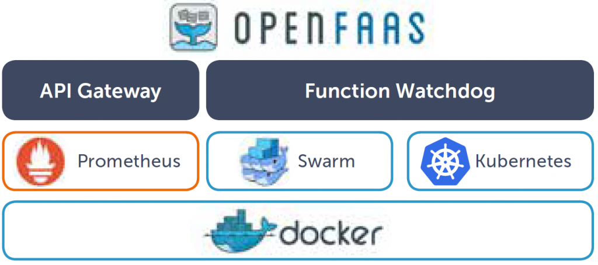

# Explore OpenFaaS Development and Deployment Aspects

| Murali Cheruvu, Anand Sriramulu
| mcheruvu@iu.edu, asriram@iu.edu
| Indiana University
| hid: fa18-516-11 fa18-516-23
| github: [:cloud:](https://github.com/cloudmesh-community/fa18-516-11/blob/master/project-report/report.md)
| code: [:cloud:](https://github.com/cloudmesh-community/fa18-516-11/blob/master/project-code/readme.md)

---

Keywords: OpenFaaS, Serverless, Micro-Services, Function-as-a-service (FaaS)

---

## Abstract

Explore creating micro-services using OpenFaaS that makes serverless functions simple for containers like Docker and Kubernetes. Integrate OpenFaaS serverless functions into public cloud offerings such as, AWS and Azure, to make them even better.

## Introduction

Goals of this project is to learn how to create cloud-native micro-services using server-less concepts for better scalability and cheaper to maintain. Function-as-a-service (FaaS) methodology allows to decouple each functionality from the rest of the application, for better support, isolated deployment and scalability at each function level.  We will use OpenFaaS, an open source alternative framework to develop and deploy micro-services as FaaS in cloud-agnostic way. OpenFaaS has an opiniated way of developing FaaS and deploying them to achieve the required scalability without much depending on the infrastructure of the public cloud offerings, using container concepts wrapped around our FaaS functions. In the context of developing loosely couple components, we can interchangeably use micro-service for function-as-a-service (FaaS). 

Let us introduce some of the key concepts that are related to the function-as-a-service.

### Micro-Services

Micro-Services is a new paradigm in the software architecture to break down complex monolithic applications into more manageable and decoupled components that can be created and supported in silos. Loosely coupled components offer scalability and also we can use programming-of-choice based on the nature and complexity of the component, anywhere from advanced Object-Oriented Programming (OOP) languages like Java and C#.net, to modern functional-programming (FP) languages like Scala or Python. Deploying micro-services can be as flexible as deploying each individual functionality as a separate micro-service to grouping of related micro-services into one deployment package [@microservices_2014]. Micro-Services, targeting for web-based interfaces, can be implemented using simple REST-based API methodology. 

### API Gateways

Micro-Services offer flexibility and scalability but they bring complexity into the deployment and support. Too many micro-services can create confusion in discovering them and also, client applications may have to make multiple micro-service calls, hence create more network traffic even to populate a single webpage. As an example, Amazon uses lots of micro-services to display a typical product search result webpage. To reduce the network round-trips, it is advised, to create a gateway - API gateway, so that clients make unified calls to the gateway and all the related micro-services to fulfill a request will be made within the server and the results of these micro-services are bundled into one result, hence reduce the number of calls to make [@smart-bear_2018]. Cloud Offerings such as Microsoft Azure and AWS offer API Gateways with automatic API discovery and quota-based usage along with lots of DevOp tools for continuous monitoring the scalability, performance and health-check of the micro-services. OpenFaaS has built-in API Gateway and integrates well with continuous monitoring tools such as **Grafana** and **Prometheus** [@openfaas_devop_2016]. 

### Serverless

Serverless is the new methodology that cloud providers such as AWS, Azure or Google Cloud brought to simplify the deployment, execution and support of micro-services. Cloud providers take care the responsibility of the deployment, execution of the code and supporting - monitoring, tracking and notifying errors, auto-scaling (up or down) and performance metrics. Application providers are responsible to develop in a cloud-native fashion and leave the rest of the responsibilities to the cloud providers. AWS Lambda, Azure Functions, Google Functions are serverless offerings that are available today with high scalability turned on and cheaper to host such serverless functions [@serverless_2018].  

### OpenFaaS

OpenFaaS (Functions as a Service) is a framework for creating micro-services that can be hosted in containers like Docker or Kubernetes and make these services ready to be served in a serverless fashion [@openfaas_intro]. OpenFaaS can easily deployed into all the popular public cloud providers such as AWS, Azure and Google Cloud.

{#fig:OpenFaaS}

## Requirements

This project has two goals - (1) How to deploy machine learning algorithm to production and make it to work as serverless function to get best scalability and (2) Explore OpenFaaS and related tools to develop, test and deploy onto public cloud providers such as Azure, AWS and Google Cloud.

High level requirements include: setting up OpenFaaS locally within the development environment in Windows and also create deployable aspects: containerized OpenFaaS to be able to deploy to public cloud offerings including AWS, Azure and Google Cloud. Create python based project exploring high level concepts of serverless/micro-services for web. Explore container features in the process. 

* Development Environment: Windows 10 Enterprise
* Install Docker Community Edition and Docker Swarm with single-node cluster
* Setup developer account with Docker Hub for publishing Docker Images on the internet
* Install OpenFaaS CLI - command line interface for OpenFaaS
* Deploy OpenFaaS into the development environment to make it ready to use
* Install Python and related libraries to make it ready for the actual project for machine learning algorithms to run and also write OpenFaaS functions in python.
* Write Python based code for object (image) detection using Convoluted Deep Neural Network (CNN) algorithms
* Train the model using around 20,000 images of dogs and cats provided by one of Kaggle competition [@dogs_vs_cats].  
* create OpenFaaS function to predict the uploaded image - whether it is a dog or cat
* create another OpenFaaS function to detect the uploaded image as what animal using pre-trained model by Keras library.

## Design 

Create image object detection and classification model using Convolutional Neural Network by exploring very small number of training examples, from the dataset of 20,000 images of dogs and cats, using Python libraries such as Keras and Tensorflow. We will train the small neural network as a baseline and apply fine-tuning of an existing pre-trained network provided by popular VGGNet image network [@chollet_2016]. We will provide some background on the concepts of neural network to understand the project domain.

### Neural Network

Neural Network is modeled after the human brain, specifically the
way it solves complex problems. Perceptron, the first generation
neural network, created a simple mathematical model or a function,
mimicking neuron - the basic unit of the brain, by taking several
binary inputs and produced single binary output. Sigmoid Neuron
improved learning by giving some weightage to the input based on
importance of the corresponding input to the output so that tiny
changes in the output due to the minor adjustments in the input
weights (or biases) can be measured effectively. Neural Network
is, a directed graph, organized by layers and layers are created by
number of interconnected neurons (or nodes). Every neuron in a
layer is connected with all the neurons from the previous layer;
there will be no interaction of neurons within a layer. As shown
in +@fig:NeuralNetwork, a typical Neural Network contains three layers: input
(left), hidden (middle) and output (right) [@Goodfellow2016]. The middle layer is
called hidden only because the neurons of this layer are neither the
input nor the output. However, the actual processing happens in the
hidden layer as the data passes through layer by layer, each neuron
acts as an activation function to process the input. The performance
of a Neural Network is measured using cost or error function and the
dependent input weight variables. Forward-propagation and backpropagation
are two techniques, neural network uses repeatedly
until all the input variables are adjusted or calibrated to predict
accurate output. During, forward-propagation, information moves
in forward direction and passes through all the layers by applying
certain weights to the input parameters. Back-propagation method
minimizes the error in the weights by applying an algorithm called
gradient descent at each iteration step.

![Neural Network [@Goodfellow2016]](images/neuralnetwork.png){#fig:NeuralNetwork}

### Deep Neural Network

Deep Learning is an advanced neural network, with multiple hidden
layers (thousands or even more deep), that can work well with
supervised (labeled) and unsupervised (unlabeled) datasets. Applications,
such as speech, image and behavior patterns, having complex
relationships in large-set of attributes, are best suited for Deep
Learning Neural Networks. Deep Learning vectorizes the input
and converts it into output vector space by decomposing complex
geometric and polynomial equations into a series of simple transformations.
These transformations go through neuron activation
functions at each layer parameterized by input weights. For it to be
effective, the cost function of the neural network must guarantee
two mathematical properties: continuity and differentiability.

![Deep Neural Network [@Goodfellow2016]](images/deepnetwork.png){#fig:DeepNeuralNetwork}

### Convolutional Neural Network (CNN)

Convolutional Neural Network (CNN), also called multilayer perceptron
(MLP), is a deep feedforward network, consists of (1) convolutional
layers - to identify the features using weights and biases,
followed by (2) fully connected layers - where each neuron is connected
from all the neurons of previous layers - to provide nonlinearity,
sub-sampling or max-pooling, performance and control
data overfitting [@ChristopherOlah2014]. CNN is used in image and voice recognition applications
by effectively using multiples copies of same neuron and
reusing group of neurons in several places to make them modular.
CNNs are constrained by fixed-size vectorized inputs and outputs.

Convolution Neural Network has two key components: (a) feature extraction - in this component, the network performs a series of convolutions (mathematical operation) and pooling operations to create the feature-maps, the list of features from the images. (b) classification - fully connected layers will serve as a classifier on top of these extracted features. They will assign probability for the object on the image being what the algorithm predicts it is. 

![Convolutional Neural Network (CNN) [@Chang2016]](images/cnn.png){#fig:CNN}

## Architecture

Computer vision is an interdisciplinary field that deals with how computers can be made for
gaining high-level understanding from digital images or videos. Images are treated as a matrix of pixel values. By applying convolutional, mathematical operation, features such as edges, brightness or blur can be extracted as feature maps from the images. This process goes through series of convolutions followed by pooling to reduce the size the of the images for further processing. In the end, various features of the image are flattened into vector and create deep neural network to classify the image, in our case, whether it is a dog or cat. VGGNet is very popular image network that reduced the errors in the image classification and improved the processing performance from the predecessor image network models. We will create our based neural network model using a small sample dataset of 2000 images from the given 20,000 images and apply this on top of the pre-trained model that is optimized based on VGGNet algorithm. So that our effort is incremental and minimal.


## Dataset

About 20,000 images of dogs and cats are provided part of the Kaggle competition. Dataset can be downloaded from [HERE](https://www.dropbox.com/s/lrcq8x8qp7cd4si/train.zip?dl=0).

## Implementation

### Install Docker Swarm (Single-Node Cluster), Docker and OpenFaaS

* **Prerequisites:** Windows 10 Professional or Enterprise Edition, open the command prompt in Administrator moode
* **Step 1:** Install Docker [Community Edition](https://store.docker.com/editions/community/docker-ce-desktop-windows)
* **Step 2:** Install Git Bash for pulling the latest OpenFaaS artifacts and all the other software from GitHub
* **Step 3:** Run **docker swarm init** to set up the single-node docker swarm cluster
* **Step 4:** Create an account with Docker Hub, if the created docker images to be shared with others through internet
* **Step 5:** Run **docker login** to make sure docker is linked to your account
* **Step 6:** Download latest **faas-cli.exe** from [HERE](https://github.com/openfaas/faas-cli/releases)
* **Step 7:**  Copy the **faas-cli.exe** to *C:\windows* folder to make it available for the command prompt. 
                Or you will need to add the path of the faas-cli.exe into the system environment variables
* **Step 8:** Test the faas-cli using the command - **faas-cli version** 
* **Step 9:** Clone the OpenFaaS artifacts from GitHub using : git clone https://github.com/openfaas/faas
* **Step 10:** Go into the **faas** folder that to checkout the git master repository - cd faas and  git checkout master
* **Step 11:** Run **deploy_stack.sh --no-auth**  to deploy the latest OpenFaaS into our environment
* **Step 12:** Run **docker service ls** to verify whether openfaas has been deployed to our environment

### Trouble Shooting

If there are any issues with the docker and/or OpenFaaS functions, we can reset the environment using the following commands

* **restart docker** - to restart the docker
* **docker stack rm func** - to remove all the functions
* **docker swarm leave --force** - to shutdown the docker cluster
* **docker swarm init** - to initialize docker swarm cluster
* **{open_faas_github_folder}/deploy_stack.sh** - to pull the latest code from openfaas GitHub

### Build and deploy a serverless OpenFaaS function

#### Get FaaS-CLI
```
curl -sSL https://cli.openfaas.com | sudo sh
```

#### Build, deploy and push to Docker Hub

```bash
$ cd fa18-516-11/project-code
$ docker build -t faas-ressnet .
$ faas-cli deploy --image faas-ressnet --name faas-ressnet
$ docker tag faas-ressnet $anandid/faas-ressnet
$ docker push $anandid/faas-ressnet
```

#### Testing OpenFaaS function

##### Test Request : 1


```
Input:
curl -X POST -H  \
  --data-binary @data/tiger.png \
  "http://127.0.0.1:8080/function/faas-resnet" 

Output:

Predicted: [('n02129604', 'tiger', 0.92411584), ('n02123159', 'tiger_cat', 0.04635064), ('n02391049', 'zebra', 0.017654872)]

```  

##### Test Request : 2


```
Input:
curl -X POST -H  \
  --data-binary @data/cow.jpg \
  "http://127.0.0.1:8080/function/faas-resnet" 

Output:

Predicted: [('n02403003', 'ox', 0.55445725), ('n03868242', 'oxcart', 0.36393312), ('n02109047', 'Great_Dane', 0.035532992)]
```  

### Deploying to AWS

#### Setup AWS Instance

1. Purchased Spot Instance for Ubuntu 16.04, and with instance type we’ll use m4.xlarge
2. Enabled Security group allowing ports 22, 31112, and 6443 for ingress
3. Created a key-pair file, so that we can SSH in to the instance
4. Test the Instance

```
ssh -i "faas.pem" ubuntu@ec2-18-191-176-209.us-east-2.compute.amazonaws.com
```

#### Setting up Kubernetes on AWS

1. Prep the machine by installing some necessary components. Run the following commands to enter superuser mode, install some necessary components from this gist, then exit back into the ubuntu user.

```
$ sudo su
$ curl -sSL https://gist.githubusercontent.com/ericstoekl/1d4372e9398d9cec7ec028629b2c36e2/raw/6f03cf3481c10e3bcf01a495a273a975aaac8ced/gistfile1.sh | sh
exit
```

2. Deploy Kubernetes

```
$ sudo kubeadm init --kubernetes-version stable-1.8
```

3. Networking layer for the cluster, to allow inter-pod communication

```
$ kubectl apply -f "https://cloud.weave.works/k8s/net?k8s-version=$(kubectl version | base64 | tr -d '\n')"

```

4. To Allow container placement on the master node and confirm the cluster is running

```
$ kubectl taint nodes --all node-role.kubernetes.io/master-

$ kubectl get all -n kube-system
```

#### Deploying OpenFaas on Kuberetes using faas-netes

1. Clone the node, Deploy the Whole Stack and deploy OpenFaas
```
$ git clone https://github.com/openfaas/faas-netes
$ kubectl apply -f https://raw.githubusercontent.com/openfaas/faas-netes/master/namespaces.yml
$ cd faas-netes && \
kubectl apply -f ./yaml
```

2. Install the CLI, deploy samples

```
$ curl -sL https://cli.openfaas.com | sudo sh
$ git clone https://github.com/openfaas/faas-cli
```

3. Pull docker image (OpenFaas functions)

```
docker pull anandid:faas-resnet
```

4. Deploy OpenFaas Functions 

```
faas-cli deploy --image anandid/faas-resnet --name faas-resnet --gateway http://18.191.176.209:31112
```

5. Test OpenFaas function

```
curl http://18.191.176.209:31112/function/faas-resnet --data-binary @data/tiger.jpg
```
### Deploying to Raspberry PI Clusters

![PI Cluster Case [@pi_cluster_case]](images/pi_clusters_case.jpg)

#### Burn 3 Raspbery PI clusters thru cm-burn

```
$ git clone https://github.com/cloudmesh-community/cm-burn
$ cd cm-burn
$ python setup.py install
$ cmburn create --group g1 --names red[001-003] --key c:/users/anand/.ssh/id_rsa.pub --image 2018-06-27-raspbian-stretch.img --bootdrive I --rootdrive G --domain 192.168.1.254 --ip 192.168.1.[111-113]``

```

#### Steps to setup OpenFass in Rasberry PI

1. Install Docker using the following utility script
```
$ curl -sSL https://get.docker.com | sh
```
Note: the above step can take between 2 to 5 minutes

2. Run the following command to use Docker as non-root user
```
$ sudo usermod pi -aG docker
```
3. Change default Password
```
$ sudo passwd pi
```
4. Logout and log back to take this effect for the above 2 steps

5. Setup docker swarm cluster
```
$ docker swarm init
```
Copy the output from the above command as like following, and need to be used in other PI nodes to join the cluster
docker swarm join --token SWMTKN-1-25qnthaepgkcxx9qhfouh7yx0ht23od2shf44bw8tfphibsod8-b1c8o5ljjetm0vjkmamo3kk9k 192.168.1.111:2377

6. Setup OpenFaas
```
$ git clone https://github.com/alexellis/faas/
$ cd faas
```
7. Deploy sample functions
```
$ ./deploy_stack.armhf.sh
```

Other RPis will now be instructed by Docker Swarm to start pulling the Docker images from the internet and extracting them to the SD card. The work will be spread across all the RPis so that none of them are overworked.

8. After few minutes, the following command will provide the status of the functions
```
$ watch 'docker service ls'
```
9. Testing a function to see the scheduled RPI for this function
```
$ docker service ps func_markdown
```
10. The Openfaas functions can be access via
```
http://192.168.1.111:8080
```
11. Pull docker image (OpenFaas functions)

```
docker pull anandid:faas-resnet
```

12. Deploy the image to the OpenFaas
```
$ faas-cli deploy --image anandid/faas-resnet --name faasresnet --gateway http://192.168.1.111:8080
```

13. Test OpenFaas function

```
curl http://192.168.1.111:8080/function/faasresnet --data-binary @data/tiger.jpg
```


#### Install Python Libraries

Following are the steps used to install Python libraries:

* Install latest Anaconda for Windows 64-bit for Python 3
* Once Anaconda installed, use the Anaconda command prompt, to install Tensorflow and Keras
* We can add Python exe folder into windows system environment path variable, so that we can use python from the regular command prompt
* We can install Jupyter Notebook as well, given we are using Jupyter notebook to write the CNN algorithm for the image classification
* Detailed steps are provided in the installation/deployment instructions

### Project Files

|  File             | Description                           |
| --------          | ------------------------------------- |
| readme.md         | Instructions on how to deploy and use OpenFaaS Serverless Functions.   | 
| Dockerfile      | Docker Image file with our OpenFaaS function and all the python dependencies that can be deployed onto typical public cloud providers: Azure, AWS, Google Cloud.  
|  resnet_pretrained_classify | OpenFaaS serverless function folder with related files to classify the uploaded animal image using ResNet image network pre-trained model using Keras and Tensorflow libraries. The classification happens very quick, hence qualifies to be a serverless function. |
|  index.py | Entry python file to call in the docker image.  |
|  image_classifier_dogsandcats.ipynb | Jupypter notebook with detailed analysis and exploration of Convolutional Neural Network to train the model using about 20,000 images of dogs and cats. The saved model will be used in the OpenFaaS function to test the classification of the uploaded image. Python uses Keras and Tensorflow Neural Network to perform the modeling.|
|  classify_pre_trained_model.ipynb | Jupypter notebook to classify image of an animal using ResNet50 pre-trained model through Keras and Tensorflow. |

## Conclusion

OpenFaaS facilitates clean design, development, deployment and support of the function-as-a-service (micro-services) implementations. OpenFaaS creates co-opetitive (co-operation and competition) environment with public cloud providers. With all the needed built-in methodologies - API Gateway, FaaS, etc. and tools - security, logging, integrations with DevOp tools, etc., OpenFaaS is already a very good open source alternative for building micro-services and maturity of this framework is drastically increasing with growing usage community and adoption. OpenFaaS can be helpful to host variety of FaaS functions all the way from http-based functions to complex functions such as machine learning based predictions and classifications. 

## Team Members and Work Breakdown

* Murali Cheruvu worked on the CNN, OpenFaaS function, Docker Image and Deploying Azure (Single-Node Cluster)
* Anand Sriramulu worked on OpenFaaS function, Docker Image and Deploying to Raspberry Pi (Multi-Node Cluster)

## Acknowledgement

The author would like to thank Dr. Gregor von Laszewski and the Teaching Assistants for their support and valuable suggestions. Author would also like to thank authors listed in the bibliography along with OpenFaas and the community of OpenFaaS for great collaboration and providing invaluable documentation and sample projects. 
